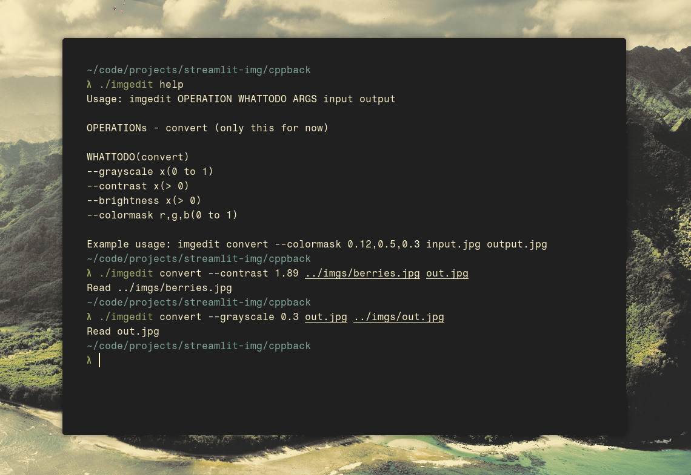

# imgedit
A command line image editor with features like grayscale, contrast, brightness, colormask.  
More features to be added soon.  

## usage
It is intended to be used as a command line application, but there is a live demo on [streamlit](https://imgedit-savar.streamlit.app). Though I discourage testing it out because of compile time differences of the imgedit binary.  

  

## todo
- [ ] make a better front end
- [ ] add crop, rotate, steganography, gamma, sepia, hue etc
- [ ] find an elegant way to write cli apps

For now the backend on the webapp is opencv python, but I plan to soon change it to self-written cpp.  
I also plan on adding crop.  
